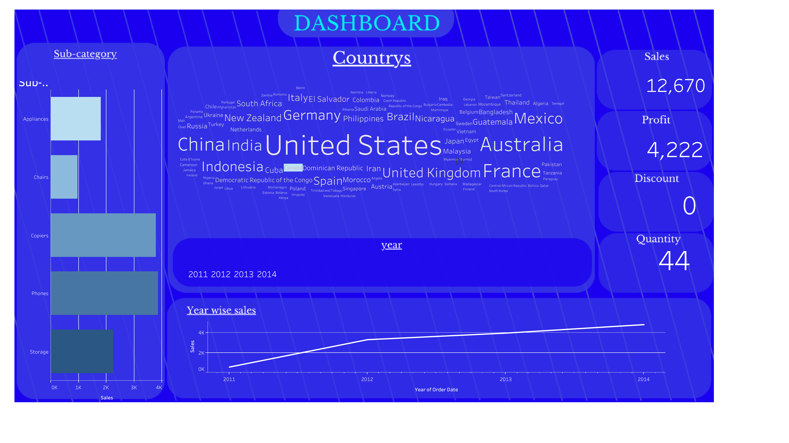

# Global Sales and Performance Dashboard

## Purpose
This dashboard appears to be a sales and performance overview for a company or organization, providing a comprehensive view of their global market presence and sales trends.

## Key Metrics
The dashboard includes the following key metrics:

1. **Countries**: A word cloud displaying the various countries the company operates in, including major markets like the United States, China, India, and European countries.
2. **Sales**: The total sales figure for the company, which is 12,670.
3. **Profit**: The company's profit, which is 4,222.
4. **Discount**: The discount amount, which is 0.
5. **Quantity**: The total quantity sold, which is 44.
6. **Year-wise Sales**: A line chart showing the company's sales performance over the years 2011 to 2014.

## Insights
Based on the information presented in the dashboard, we can derive the following insights:

1. **Global Reach**: The company has a diverse global presence, operating in a wide range of countries across different regions, including the Americas, Europe, Asia, and Oceania.
2. **Sales Trend**: The year-wise sales chart indicates a positive trend, with sales increasing steadily from 2011 to 2014.
3. **Profitability**: The company appears to be profitable, with a significant profit figure of 4,222.
4. **Pricing Strategy**: The dashboard shows a discount of 0, suggesting the company may not be offering significant discounts on its products or services.
5. **Product Quantity**: The total quantity sold, 44, could indicate a relatively low-volume, high-value product or service offering.
